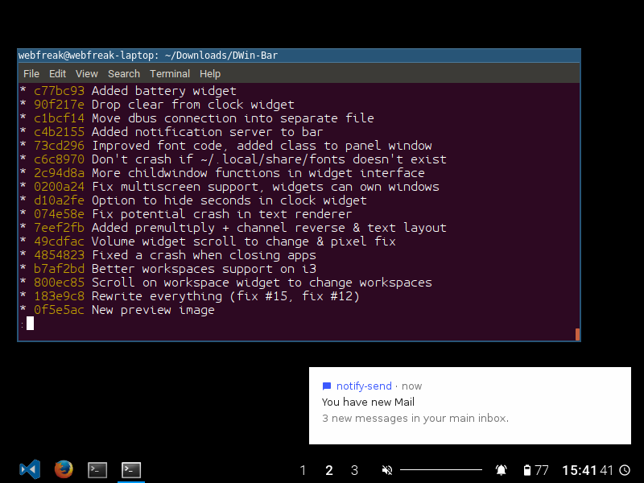

# DWin-Bar

A taskbar and notification server for linux designed for DWin. Also works with other window managers implementing the EWMH standard.

Setting up bars currently only works in the source code, however the API is really simple. If you want to change
the orientation, screens or widgets simply change source/app.d and rebuild using `dub`. There is a widget interface
in source/widgets which can be extended and added to the bars. The clock widget is a good widget to base on.